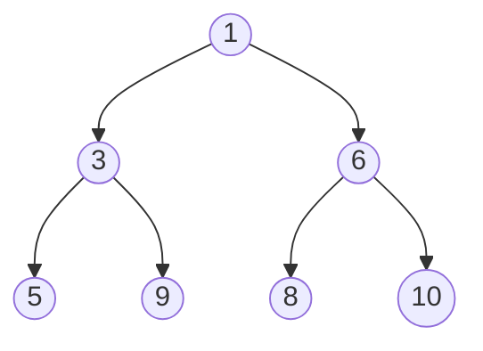

# Heap

## Complexity

| Opearation  | Complexity  |     |
| ----------- | ----------- | --- |
| `top()`     | $O(N)$      |     |
| `insert()`  | $O(\log N)$ |     |
| `remove()`  | $O(\log N)$ |     |
| `heapify()` | $O(N)$      |     |


## Heap example 

`arr = [1, 3, 6, 5, 9, 8, 10]`



```python
import heapq

arr = [1, 3, 5, 7, 9, 2, 4, 6, 8, 0]
heapq.heapify(arr)
# arr = [0, 1, 2, 6, 3, 5, 4, 7, 8, 9]
heapq.heappush(arr, 10)
# arr = [0, 1, 2, 6, 3, 5, 4, 7, 8, 9, 10]
heapq.heappop(arr)
# 0
heapq.heappop(arr)
# 1
arr[0] # peek the top element
# 2 
heapq.nlargest(3,arr)
# [10, 9, 8]
heapq.nsmallest(3,arr)
# [2, 3, 4]
 ```


```python
from collections import Counter

import heapq

  
  

class Solution:

def topKFrequent(self, nums: List[int], k: int) -> List[int]:

# TC:O(N)

# SC:O(N)

count = Counter(nums)

  

return heapq.nlargest(k,count.keys(),key=count.get)
```
