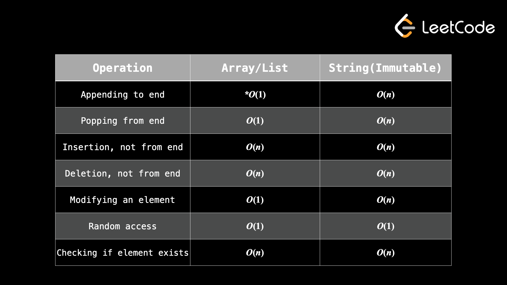

# Arrays and string

-  ❗Amortized **O(N)** not **Big O(N)** [explanation link](https://stackoverflow.com/questions/33044883/why-is-the-time-complexity-of-pythons-list-append-method-o1)



## Notes

- Under **Array** we tipically use **Dynamic array**
- array/list    is <b style="color:#88EE88">Mutable</b>
- string        is <b style="color:#EE6666">Immutable</b>

- <b style="color:#88EE88">Mutable</b> a type of data that can be changed. 
- <b style="color:#EE6666">Immutable</b> A type of data that cannot be changed. If you want to change something immutable, you will need to recreate the entire thing.

## Making <b>REAL</b> array 

``` python
# Method 1
import array as arr

my_arr = arr.array('i',[1,2,3,4])

# Method 2 Numpy
import numpy as np
my_arr = np.array([1,2,3,4],dtypeli='int32')

```


## Operation with a string

```python
s = "Hello world"

# string to array
arr = list(s)

for c in arr:
    print(f'{c}')

# array into string
newS = ''.join(arr)

```

