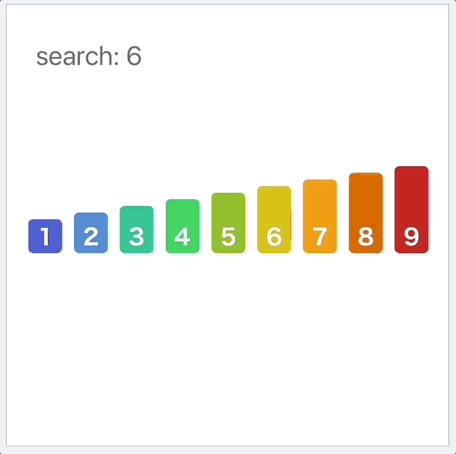

# Binary Search

 

- [LeetCode CrashCourse](https://tinyurl.com/4thm3ddb)

Binary search working by having infinite loop:

`while l<=r`  

Each time we calculate the mid point of the array,
we compare the mid point with the target value, and if it is equal, we return the mid point.

 **Smaller:**
`if nums[mid] < target`

`l = mid + 1`

**Larger:**
`if nums[mid] > target`

`r = mid - 1` 

❗ To avoid **overflow**

`mid = l + (r-l) // 2`

## Algorithm

Time Complexity:    `O(log n)`

Space Complexity:   `O(1)`


<details>

 <summary> 
    <b>Python implementation</b>
</summary>

```python
def binarySearch(nums:[int],target:int)->int:
    l,r = 0, len(nums)-1 
    while l<=r:
        mid = (l+r) // 2
        if nums[mid] == target:
            return mid
        elif nums[mid] > target:
            r = mid - 1
        else: # nums[mid] < target
            l = mid + 1
    return -1
```
</details>

