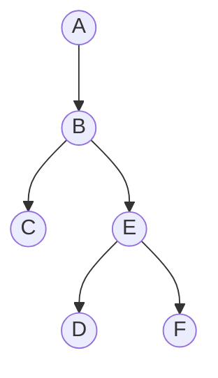

## Adjacency list 

```python 
class GraphNode:
	def __init__(self,val):
		self.val = val
		self.neighbours = val
		
adjList = [ ["A", "B"] ,["B","C"], ["B","E"], ["C","E"] ,["E", "D"]]

adjList = {}

for src,dst in edges:
	if not src in adjList:
		adjList[src] = []
	if not dst in adjList:
		adjList[dst] = []
	adjList[src].append(dst)
	
```



## DFS 

```python
def dfs (node,target, adjList, visit):
	if node in visit:
		return 0
	if node == target:
		return 1
	
	count = 0 
	visit.add(node)

	for neighbour in adjList[node]:
		count = += dfs(neighbor, target, adjList, visit)
	visit.remove(node)

	return count

print(dfs("A", "E", adjList, set()))

```

## BFS 

```python
# Shortest path from node to target
def bfs(node, target, adjList):
    length = 0
    visit = set()
    visit.add(node)
    queue = deque()
    queue.append(node)

    while queue:
        for i in range(len(queue)):
            curr = queue.popleft()
            if curr == target:
                return length

            for neighbor in adjList[curr]:
                if neighbor not in visit:
                    visit.add(neighbor)
                    queue.append(neighbor)
        length += 1
    return length
```

```python 
	def bfs ( node,target, adjList):
		length = 0
		
		visit = set()
		visit.add(node)
		
		queue = deque()
		queue.append(node)
	while queue:
		for i in range(len(queue)):
			curr = queue.popleft()
			if curr==target:
				return length
		for neighbor in adjList[curr]:
			for neighbor not in visit:
				visit.add(neighbor)
				queue.append(neighbor)
		length +=1 
	return length 	
		
```
