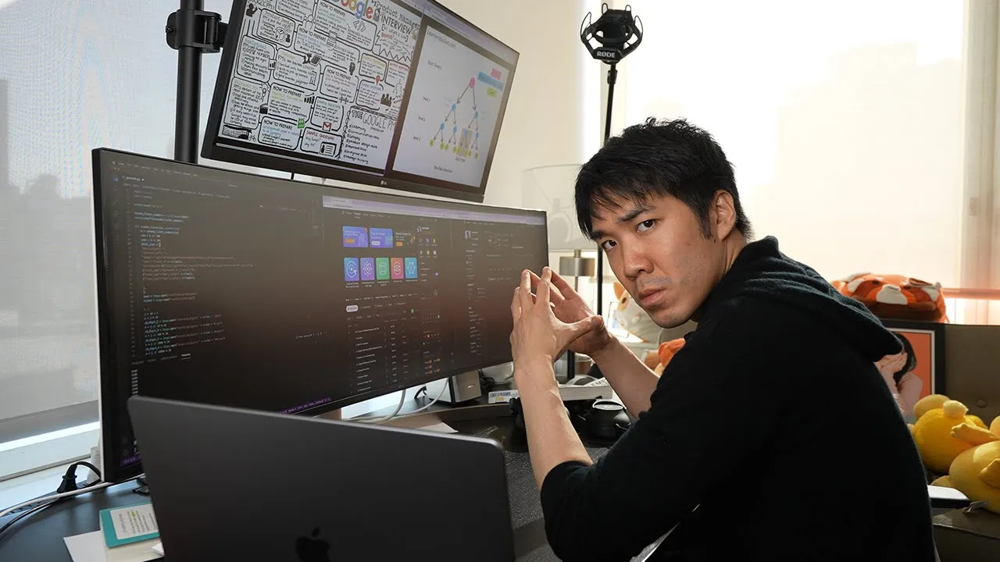

# Tech Interview Resources

## Todo

- Article about LeetCode dou 
- Hcks with string

 ## Global resources

- [Mock interview Examle](https://www.youtube.com/watch?v=46dZH7LDbf8)
- [📔Tech Interview Handbook](https://www.techinterviewhandbook.org/)
> **Best Roadmap**
> Direct roadmap to help you prepare for a technical interview and land a **FAANG** job.

 - [🎓Coding interview University](https://github.com/jwasham/coding-interview-university)
> **Best collection of resources** 
> Collection of all possible resources with really good articles and explenations.
 
- [🚀NeetCode.io](https://neetcode.io/) 
> **Best tutorials and Roadmap for LeetCode level up**

## Lists of **LeetCode Questions**

- [📃 LeetCode75](https://leetcode.com/studyplan/leetcode-75/)
- []

## 🇺🇦 Ukrainian Resources

- [📚 Dou.ua: Как попасть в Google: инструкция по подготовке by *Sergi Semi*](https://dou.ua/lenta/articles/google-interview/)

- [📚 Dou.ua: Как я искал работу в США во время пандемии, подался на 200 вакансий и получил оффер на $380K by *Adam Leos*](https://dou.ua/lenta/interviews/get-job-in-usa-during-pandemic/)

- [📨 Telegram: **FAANG interview  🇺🇦 **](https://t.me/FaangInterviewUa)
> **Best Ukrainian community** for FAANG. ❗Mocks & study groups❗

- [📨 Telegram: **FAANG interview 🦅**](https://t.me/FAANG_USA)
> **Active Ukrainians in US** Best for selaries migration and really fun to participate a lot of referals.

- [📨 Telegram: **Tech Resume Review**](https://t.me/resume_reviewew)
> **Slavic Community(ua/by/rus)** Resume review good enought Community but you can meet russians there. But except that good enough

## Best Youtube Channels

- [Pirate King](https://www.youtube.com/watch?v=17cQGPLbmfQ)
> Good guides and overall strategies for coding interviews.

- [Joma Tech](https://www.youtube.com/watch?v=5bId3N7QZec)
> Fun and informative a lot of good interviews with software engineers.

- [ThePrimeagen](https://www.youtube.com/watch?v=hW5s_UUO1RI)
> ♂ 💪 **REAL** ♂ 💪 **MALE** way of coding & 🥲 fun to watch if you love pain and VIM.

### System Design 
![[Pasted image 20250222111436.png]]