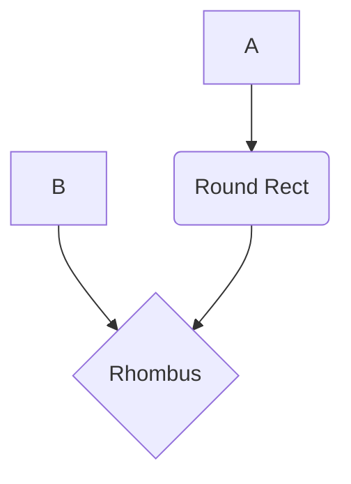

# Trie

- Pronunce like **try**
- 

- [LC Crash Course explentation](https://leetcode.com/explore/interview/card/leetcodes-interview-crash-course-data-structures-and-algorithms/714/bonus/4549/)
- [208. Implment Trie(Prefix Tree) on **LC**](https://leetcode.com/problems/implement-trie-prefix-tree/description/ )

Below is simple example of Trie data structure.

```python
class TrieNode:
    def __init__(self):
        self.children = {}
        self.isEnd = False

```

