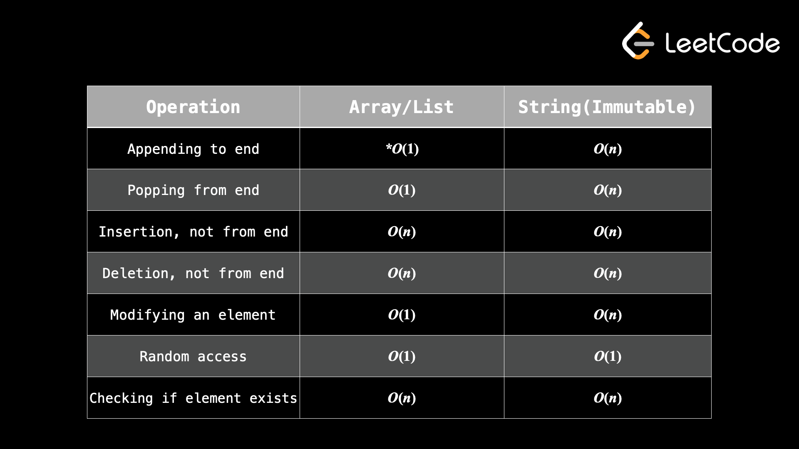

# Arrays and string



## Operation with a string
```python
s = "Hello world"

# string to array
arr = list(s)

for c in arr:
    print(f'{c}')

# array into string
newS = ''.join(arr)


```

<details>
    <summary>
        Some test <code>O(N) </code>
    </summary>
    bla bla 
</details>

