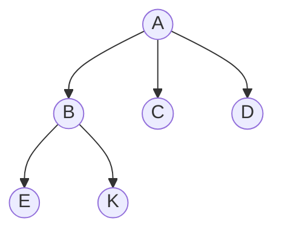
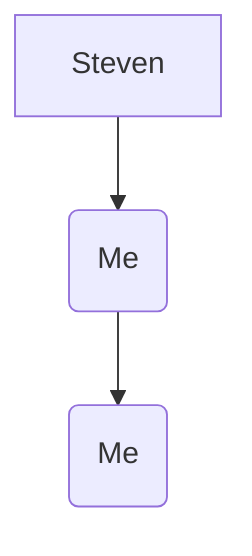

# Mermaid

- [Official Documentation](https://mermaid.js.org/syntax/examples.html)

## Exmaples

**Top Down**
*italic* **bold** ***bold italic***

Bla-bla I am wring text

**Import infomration**  to be honest *not really* 
> okay it's just damm

## My value vs Steven :( 

