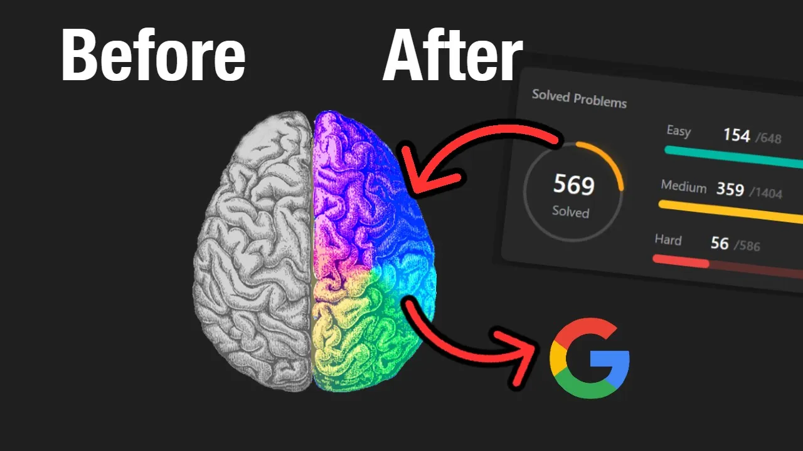

# Knowledge Base 2.0

It's my KB version 2.0 I moved from just repo in Github.
To set of notes that I am able to share to the world though the:
`ScriptoriumLudus` - my **Great Idea** sort of project

Collection of everything you need for DeepWork.

- [Video Link](https://www.youtube.com/watch?v=8wysIxzqgPI&t=46s)

## Top:

- [Cheat Sheet](./CheatSheet/index.md)
- [Compression](./Algos/Compression/index.md)
- [AI ML CV](./AI-ML-CV/index.md)
- [Python](./Python/index.md)
