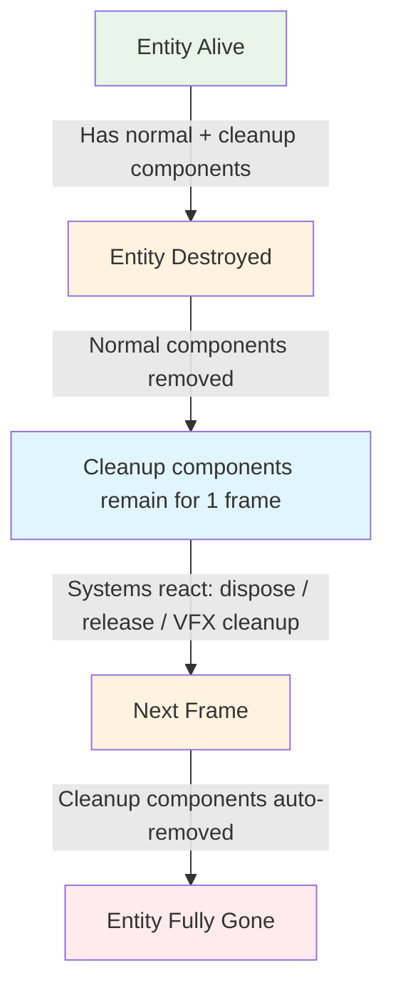
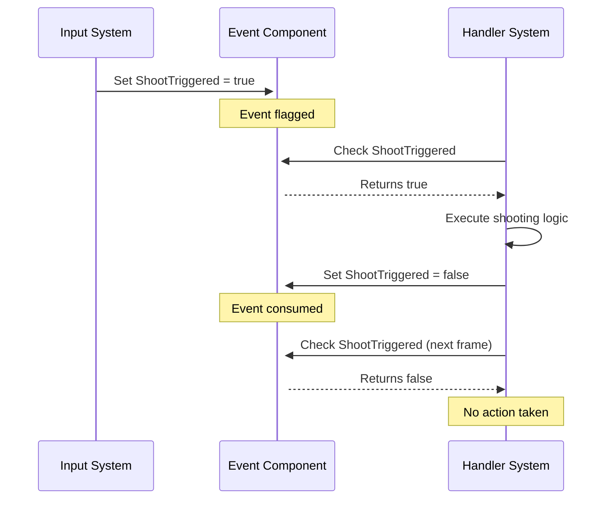

# 🎆 Unity ECS Advanced Concepts

Advanced techniques and patterns for Unity ECS development.

## Table of Contents

1. [🔌 SystemAPI](#-systemapi)
   - [🔄 Quaternion](#-quaternion)
2. [🏷️ Organizational Tags](#%EF%B8%8F-organizational-tags)
3. [🎯 Making Singleton for Input System](#-making-singleton-for-input-system)
4. [🔗 Getting Reference from MonoBehaviour to Entity](#-getting-reference-from-monobehaviour-to-entity)
5. [👩‍💼 MonoBehaviour Getting Entity Reference](#-monobehaviour-getting-entity-reference)
   - [📊 Query ToEntityArray and ToComponentDataArray](#-query-toentityarray-and-tocomponentdataarray)
   - [🔄 Updating Query using CopyFromComponentDataArray](#-updating-query-using-copyfromcomponentdataarray)
   - [📡 Events in ECS](#-events-in-ecs)

## 🔌 SystemAPI 

```csharp

Entity entity =  SystemAPI.GetSingletonEntity<InputState>();
InputState inputState = SystemAPI.GetSingleton<InputState>();
float deltaTime = SystemAPI.Time.DeltaTime;
```

### 🔄 Quaternion

```csharp
quaternion rotation = quaternion.EulerXYZ(0, 0, 0); // Create
```

## 🔄 Cleanup Component Lifecycle

🧹 Unity ECS Cleanup Components

❓ What are they?

Cleanup components are special ECS components that automatically get removed when their entity is destroyed, but they remain alive for a short time to let systems handle cleanup logic.

They are like "flags" or "temporary data holders" to let your systems safely react to entity destruction.

⸻

⚙️ How to use them

You define them with the [Cleanup] attribute:

using Unity.Entities;

[Cleanup]
public struct TrailCleanupData : IComponentData
{
    public Entity EffectEntity;
}


⸻

🔄 Lifecycle
	1.	Entity exists → has the cleanup component.
	2.	Entity is destroyed → Unity removes all normal components,
but cleanup components stay for one extra frame.
	3.	Systems can then:
	•	Dispose native collections
	•	Destroy linked entities (like VFX or children)
	•	Release resources
	4.	After that frame, cleanup components are also removed automatically.

⸻

📌 Example use case

Imagine a bullet entity that spawns an explosion effect on death:

[Cleanup]
public struct ExplosionCleanup : IComponentData
{
    public Entity ExplosionEntity;
}

When the bullet is destroyed:
	•	Normal components (position, velocity, etc.) are gone.
	•	ExplosionCleanup still exists.
	•	A system sees it and destroys the ExplosionEntity (the effect).
	•	Next frame → ExplosionCleanup is gone too.

⸻

✅ Key points
	•	Mark components with [Cleanup] if they only matter when the entity is destroyed.
	•	Useful for disposing native containers, cleaning VFX, releasing resources, or notifying systems.
	•	Saves you from null references or trying to access components that no longer exist.

⸻



## 🏷️ Organizational Tags 

```csharp
[UpdateInGroup(typeof(InitializationSystemGroup), OrderLast = true)] //Intilize in System group
[UpdateBefore(typeof(PlayerShootingSystem))]               // Update before PlayerShootingSystem
```

## 🎯 Making Singleton for Input System

```csharp
[UpdateInGroup(typeof(SimulationSystemGroup))]
[UpdateBefore(typeof(PlayerShootingSystem))] 
public partial class PlayerInputSystem : SystemBase 
{
    protected override void OnCreate()
    {
        base.OnCreate(); 
        // Ensure an InputState singleton exists
        EntityQuery q = GetEntityQuery(ComponentType.ReadOnly<InputState>());
        if (q.IsEmptyIgnoreFilter)
        {
            Entity e = EntityManager.CreateEntity(typeof(InputState));
            EntityManager.SetName(e, "InputStateSingleton");
            EntityManager.SetComponentData(e, new InputState { ShootTriggered = false });
        }
    } 
```

## 🔗 Getting Reference from MonoBehaviour to Entity 

```csharp
    VisualEntity = GetEntity(authoring.VisualEntity, TransformUsageFlags.Dynamic)
```


## 👩‍💼 MonoBehaviour Getting Entity Reference 


```csharp

private void Update(){
     EntityManager entityManager =  World.DefaultGameObjectInjectionWorld.EntityManager;
     EntityQuery entityQuery = new EntityQueryBuilder(Allocator.Temp).WithAll<UnitMoverData>().Build(entityManager);
}

```
**or** with `CreateEntityQuery`
```csharp
 EntityManager entityManager =  World.DefaultGameObjectInjectionWorld.EntityManager;
```


### 📊 Query ToEntityArray and ToComponentDataArray

- `ToEntityArray(Allocator.Temp)` - getting NativeArray of `Entiti`'s from entityQuery
- `ToComponentDataArray<UnitMoverData>(Allocator.Temp)` - getting `NativeArray` of UnitMoverData from entityQuery


```csharp 
NativeArray<Entity> entityArray = entityQuery.ToEntityArray(Allocator.Temp);;
NativeArray<UnitMoverData> unitMoverArray = entityQuery.ToComponentDataArray<UnitMoverData>(Allocator.Temp);;
```

### 🔄 Updating Query using CopyFromComponentDataArray

`CopyFromComponentDataArray` - updates **Query**(`EntityQuery`) with modified `NativeArray` of component data.

>❗️This is the only way to update component data in `EntityQuery` from `MonoBehaviour` script. Instead of updateing each entity one by one using `EntityManager.SetComponentData` in a loop.


```csharp
for (int i = 0; i < unitMoverArray.Length; i++)
{
     var unitMover = unitMoverArray[i];
     unitMover.TargetPosition = mouseWorldPosition;
     unitMoverArray[i] = unitMover;
    //entityManager.SetComponentData(entityArray[i], unitMover); // ❌ Not allowed in MonoBehaviour
}
// Update the entities with the modified component data
entityQuery.CopyFromComponentDataArray(unitMoverArray);
```
### 📡 Events in ECS 

We just create `bool` and set it to `true` when event happens. Then in other system we check if it's `true` and do the action. After that we set it back to `false`.



